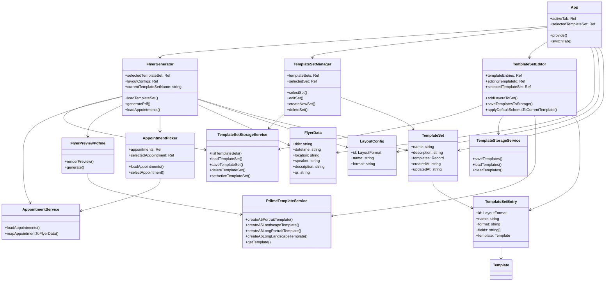
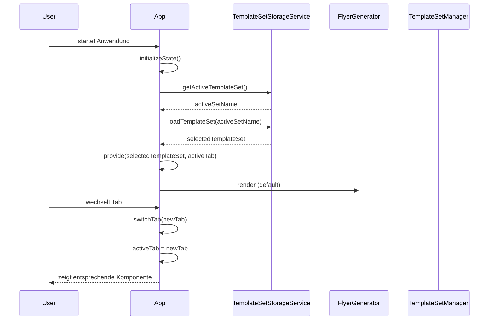
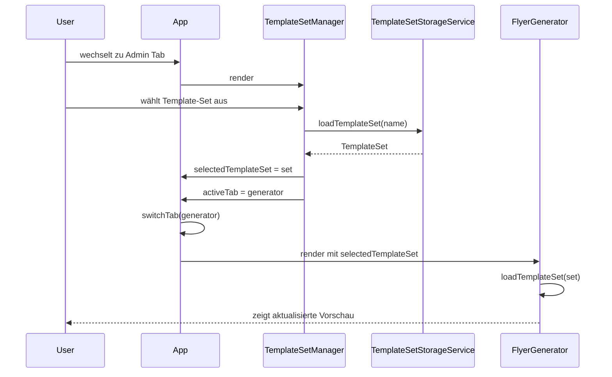
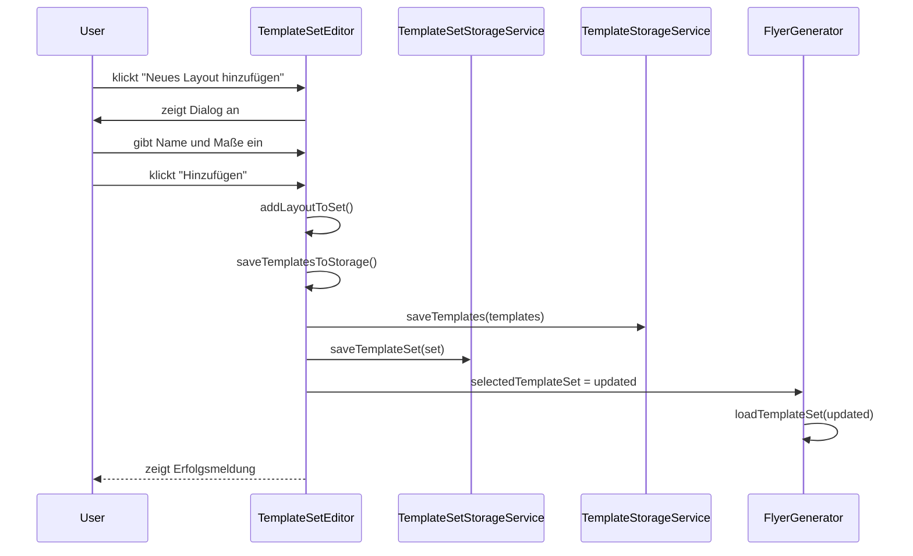
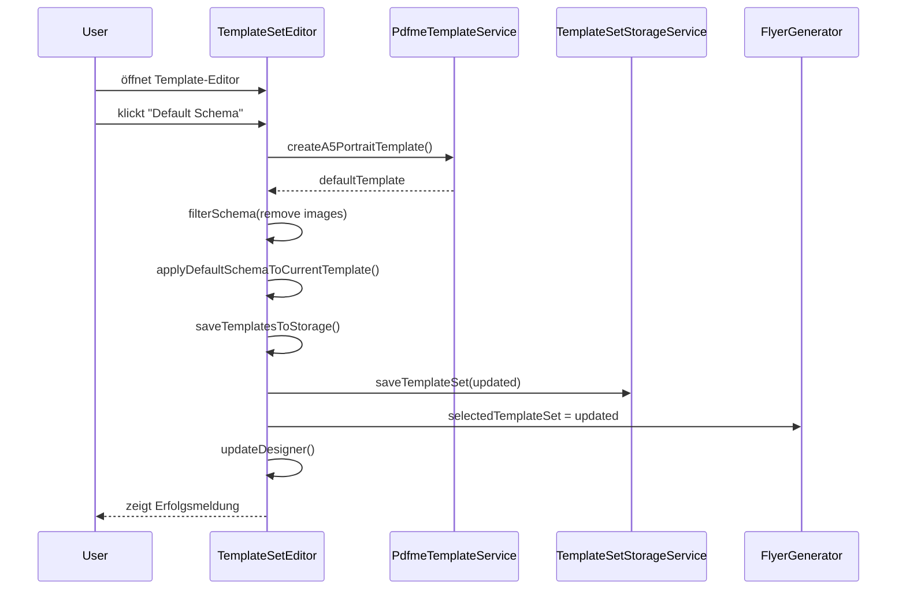
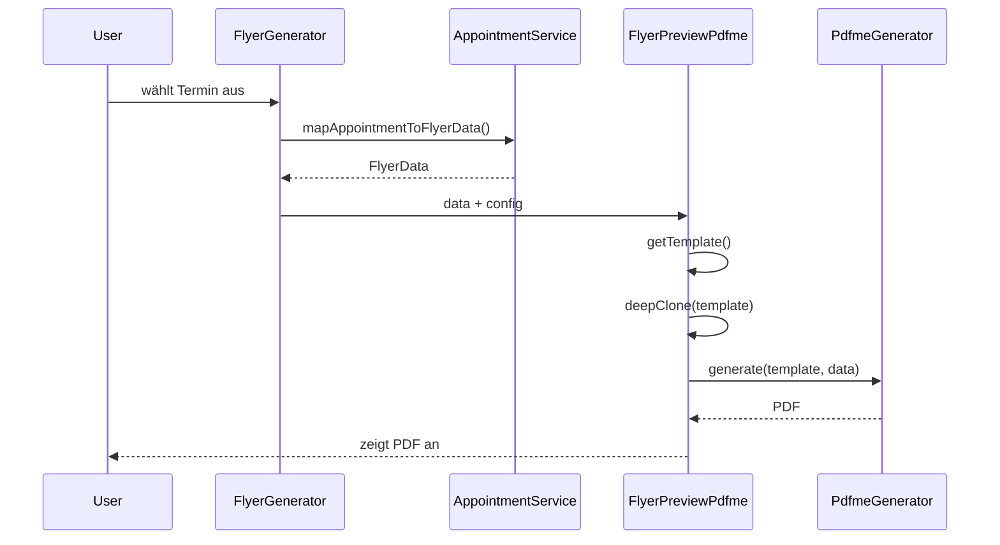

# Flyer Generator - Entwicklerdokumentation

## Übersicht

Der Flyer Generator ist eine Vue 3 Anwendung zur Erstellung von Kirchen-Fliegern aus ChurchTools Terminen. Die Anwendung verwendet PDFme für die PDF-Generierung und bietet eine flexible Template-Verwaltung.

## Architektur

### Kernkomponenten

Die Anwendung besteht aus drei Hauptbereichen:
- **FlyerGenerator**: Hauptkomponente zur Erstellung und Vorschau von Flyern
- **TemplateSetManager**: Verwaltung von Template-Sets
- **TemplateSetEditor**: Detaillierte Bearbeitung von Templates

### Datenfluss

1. **Termin-Daten**: Aus ChurchTools API geladen
2. **Template-Sets**: Aus LocalStorage geladen/gespeichert
3. **PDF-Generierung**: Mit PDFme und Template-Daten
4. **Speicherung**: LocalStorage für Templates und Sets

## Klassendiagramm



## Sequenzdiagramme

### 1. App-Initialisierung und Tab-Wechsel



### 2. Template-Set Auswahl und Laden



### 3. Neues Template hinzufügen



### 4. Default Schema anwenden



### 5. PDF-Generierung



## Datenmodelle

### TemplateSet
- **name**: Eindeutiger Name des Template-Sets
- **description**: Beschreibung des Sets
- **templates**: Record mit Layout-Format als Key und Template als Value
- **createdAt**: Erstellungszeitpunkt
- **updatedAt**: Letzte Aktualisierung

### TemplateSetEntry
- **id**: Layout-Format (z.B. 'a5-portrait')
- **name**: Anzeigename des Layouts
- **format**: Format-String (z.B. '148×210mm')
- **fields**: Liste der Feldnamen aus dem Schema
- **template**: PDFme Template mit basePdf und schemas

### FlyerData
- **title**: Veranstaltungstitel
- **datetime**: Datum und Uhrzeit
- **location**: Veranstaltungsort
- **speaker**: Referent/Sprecher
- **description**: Beschreibungstext
- **qr**: QR-Code URL

## Storage-Architektur

### LocalStorage Struktur
```
localStorage/
├── template-sets/           # Template-Sets
│   ├── set-name-1.json
│   ├── set-name-2.json
│   └── active-set.json      # Aktives Set
├── templates/               # Einzelne Templates
│   └── templates.json
└── appointments/            # Termin-Cache
    └── cached-appointments.json
```

### Speicherstrategien
1. **TemplateSetStorage**: Verwaltet komplette Template-Sets
2. **TemplateStorage**: Verwaltet einzelne Templates (Legacy)
3. **AppointmentCache**: Zwischenspeicher für ChurchTools Daten

## State Management

### Reaktive Zustände
- **selectedTemplateSet**: Global injizierter Ref für aktives Set
- **activeTab**: Global injizierter Ref für aktiven Tab
- **templateEntries**: Lokale Templates im Editor
- **layoutConfigs**: Dynamische Layout-Konfigurationen

### Datenfluss-Prinzipien
1. **Top-Down**: Props von Parent zu Child
2. **Global State**: Injizierte Refs für übergreifenden Zustand
3. **Local State**: Komponentenspezifische Refs
4. **Persistence**: Automatische Speicherung bei Änderungen

## Fehlerbehandlung

### Strategien
1. **Validation**: Eingabevalidierung vor Speicherung
2. **Fallback**: Default-Templates bei Fehlern
3. **User Feedback**: Statusmeldungen für alle Aktionen
4. **Error Logging**: Konsolen-Logs für Debugging

### Fehler-Typen
- **Network Errors**: ChurchTools API Probleme
- **Storage Errors**: LocalStorage voll/fehlerhaft
- **Template Errors**: Ungültige Template-Struktur
- **PDF Generation Errors**: PDFme Probleme

## Performance-Optimierungen

### Strategien
1. **Lazy Loading**: Templates bei Bedarf laden
2. **Caching**: ChurchTools Daten zwischenspeichern
3. **Debouncing**: UI-Updates optimieren
4. **Memory Management**: Vue Proxy-Objekte vermeiden

### Best Practices
- Deep Cloning für PDFme Templates
- Reactive State minimal halten
- Async Operationen optimieren
- Component Lifecycle beachten

## Entwicklungshinweise

### Vue 3 Besonderheiten
- **Composition API**: Konsistente Verwendung von `<script setup>`
- **Reactivity**: Refs und Reactive richtig einsetzen
- **Lifecycle**: onMounted und watch korrekt verwenden
- **TypeScript**: Strikte Typisierung beachten

### PDFme Integration
- **Template Struktur**: basePdf + schemas beachten
- **Feld-Validierung**: Required fields prüfen
- **Image-Felder**: Leere Images filtern
- **Proxy-Probleme**: Deep Cloning verwenden

### Debugging
- **Console Logs**: Ausführliche Debug-Informationen
- **State Inspection**: Vue DevTools nutzen
- **Network Tab**: API-Aufrufe überwachen
- **Storage Inspection**: LocalStorage prüfen
